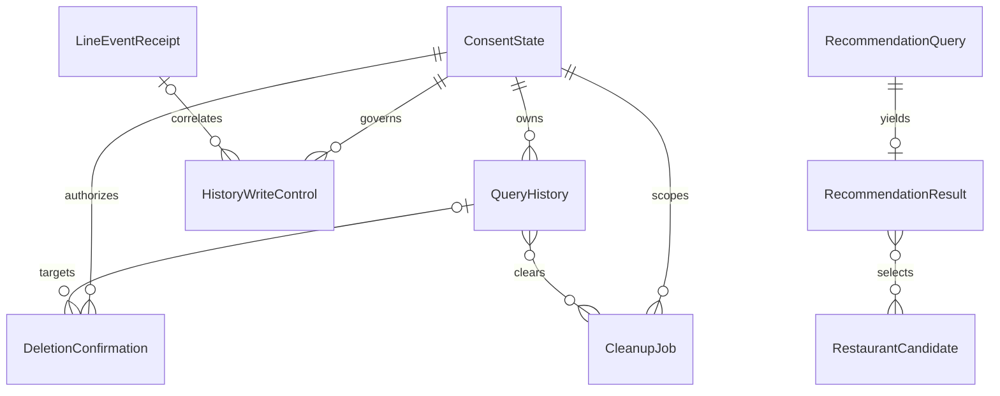

# 午餐決定器：U1 功能規格

## Sources

- [R] `../../../inception/requirements-analysis/requirements.md`：30 個 FR 主／子識別碼、9 個 NFR。
- [D] `../../../inception/domain-design/components.md`：四元件、九實體及三條單向呼叫。
- [C] `../../../inception/contract-design/contract-summary.md`：七個邊界、既定格式、LP 與失敗語意。
- [U] `../../../inception/units-generation/unit-of-work.md`、`../../../inception/units-generation/unit-of-work-story-map.md`：唯一 service 單元 U1。
- [Q] `functional-design-questions.md`：Q1、Q2 本人回答「可以」，整份摘要 Looks correct；確認紀錄 `3e57b73dec5ae98f822423198e76bba1e82c0d451c3b01022f0447d2484a58a6`。
- [E] `entities.md` 的 YAML：資料形狀唯一來源。
- [B] `rules.md` 的 YAML：BR1.1–BR10.5 各已宣告規則的唯一來源；識別碼不代表每群固定有五條。

## Scope and Authority

本文件是 **工作流程與狀態機的唯一來源**；ER 與規則摘要為 E、B 的衍生檢視。只設計 U1 的功能，沒有應用程式、SQL、框架或部署設定。U1 為 service，不產生 frontend-components.md、不另建網站。User Stories 在本案依 scope 略過，所以 traceability.json 直接使用既有 FR／NFR，不捏造 US 或 AC。

責任仍為 LineInteraction → DataPrivacy、LineInteraction → LunchRecommendation、LunchRecommendation → RestaurantSourceAdapter。回傳值不形成反向依賴；任何元件不得直接讀寫其他 owner 的資料。C 的介面及錯誤列舉不被本文件替換。

## Functional Decisions

| 項目 | 本輪定義 | 邊界 |
| --- | --- | --- |
| Q1 距離 | WGS84 橢球最短地表距離，長半軸6378137m、扁率1/298.257223563 | 非道路／步行距離；不改善輸入定位誤差。選可靠算法與驗證實作仍在後續 |
| Q2 同店資料衝突 | 先檢查同穩定店家識別的整組一致性，未解衝突整組排除 | 不挑第一筆、不猜最新、不拼欄位；不因先排除closed而留下同店open |
| 順序表示 | 目前 ConsentVersion 綁定其 LP 的不可回繞 boundaryOrder；admission、permit及cutoff用同一權威序列 | 邊界字串仍是不透明值；權威配置與時鐘能力未選定，不信任外來版本自行聲稱的順序 |
| 控制表示 | 既有 HistoryWriteControl 使用 admission、permit、deletion_barrier、cursor、choice_ref、delete_ref 變體 | 不新增持久業務欄位或永久事件索引；每變體最長七天 |
| 保存結果不明 | 沿用 ADR-004 與 C 的 saved／not_saved／unknown | 上游需求審查 R-01 是已接受待驗證風險，不宣稱已修復、已關閉或已測通 |

以上技術細化沒有新增用途或降低已確認要求；權利、效能、平台與真人條件仍待實證。

## Ordered Workflows

### WF01 — 可信入口、接收確認及期限

1. LineInteraction 先驗原始 webhook bytes 的簽章、destination 及結構；不先重建本文、不記原始內容。合法空 events 可回接收成功。驗證失敗沒有餐廳或權利副作用。
2. 逐筆區分私訊／群組、已支援事件、來源本人及時效。以首次接收時刻判斷原始時間在前24h至後5min含邊界。群組不輸出私人資料；文字地址／網址只引導傳送位置。
3. 原子 claim eventKey，固定 originalEventAt、receivedAt、deadlineAt及回覆狀態。duplicate不重做已開始業務，crash後不從位置佇列補做；claim不明時停止本次副作用。
4. 接收 HTTP 與結果 reply 分開：安全接收確認不等待完整推薦，但只交給原十秒內的必要記憶體工作。程序中止可失去尚未處理的位置，不可用持久位置佇列換可靠性。
5. C03 admission 與 first claim 以可信 eventKey 冪等關聯。兩步之間 crash 不得重建業務；平台須證明認領後生命週期，否則視為未完成而不是假稱成功。
6. 任何工作共享首次 deadlineAt；單調時間控制剩餘預算。回覆預留、個別 timeout 及 HTTP 回覆後執行能力交 NFR／Infrastructure Design，不在本階段編造平台保證。

對應 B：BR1.1–BR1.3、BR10.1–BR10.2。接收時間與 reply 接受時間各自量測。

### WF02 — 告知、設定及當次許可

1. 有效位置只在當次必要記憶體，LineInteraction 呼叫 admitQuery，傳可信context、不傳位置進權利控制資料。
2. 設定不存在／現行用途未確認：notice_required，丟棄這次位置，顯示實際用途、第三方、保存一年／不保存及重傳提示。沒有實際來源告知前只使用合成資料。
3. 設定讀取完全失敗：settings_unavailable，不外傳、不保存、不排隊。已知 no_save 不依賴歷史可寫性，仍 allowed/disabled。
4. save 選擇下，由 DataPrivacy 判定原始事件時間及首次 acceptedOrder 是否都可證明在目前同意界線後；簽發綁 event、本人、版本、notice、固定 deadline 的 permit。等時刻或無可信證據則 allowed/disabled/order_unproven，推薦仍可用但說明未保存原因。
5. 設定按鈕為本人、notice、預期版本綁定的15min ref；applyChoice 同一 LP 消費動作、更新目前狀態和boundaryOrder/version。舊ref不得覆蓋新選擇；提交ACK遺失回 outcome_unknown，重新讀設定確認，不猜選擇。
6. 選好後只處理新傳的位置；不等待或回填早到位置。設定更新成功不保證設定回覆一定被LINE接受。

對應 B：BR2.1–BR2.3、BR8.1–BR8.2。已選不保存與未知設定是兩個不同分支。

### WF03 — 來源、衝突、距離與推薦

1. 只有 admitQuery allowed 才呼叫 recommend。投影限queryKey、position、deadlineAt與當次取消；不帶subject、同意版本、歷史或LINE憑證。
2. Adapter 對已授權來源只送C06允許的必要搜尋位置、固定半徑／餐廳條件及必要來源憑證。來源、權利、映射或實際告知不成立時不得傳真人位置；不抓使用者URL，不向未核准redirect主機轉送。
3. Adapter 驗證整份資料可判讀。若需來源正常分頁，所有頁共享原期限；不得截取部分頁後當作完整候選集合。任何頁失敗／期限不足，來源故障回source_failure；來源失敗不重試，也關閉隱含重試。
4. 先依可證明的restaurantKey檢查整次查詢的同店原始候選群：只做可證明語意等價的正規化（數值的正負零、等價日期線經度等），不模糊比對名稱／地址，不默認不同地圖URL等價。candidateKey、同等來源的observedAt不構成業務版本優先權；任何不相容的來源／必要標示必須保守排除。
5. **不能讓投影遺失衝突證據**：Adapter 在刪除非餐廳或缺欄原始項之前，若其穩定ID可辨識且與同ID其他項的分類、座標、營業等資訊衝突或無法證明一致，排除整組。無法識別的個別項可剔除；如果連整份結果的結構／身份語意都不可判讀，則整份失敗。不把非法原始項硬塞進C05的Candidate schema。
6. 有效群轉成C05 Candidate，保留closed及unknown供推薦規則判斷。LunchRecommendation再對跨頁／投影集合做一致性與去重檢查；完全相同才合併，以穩定candidateKey最小者作內部代表（不影響restaurantKey排序或使用者內容）；未解衝突整店排除。這是Q2的A，不選供應方「最新版本」策略。
7. 對一致且必要資訊完整的候選，排除closed/permanently_closed。用Q1固定橢球計算搜尋點至店家最短地表距離，非有限或無可靠計算能力不能回造出的數字；遇整體計算不可用回C04 Error/not_available及誠實故障文案，不偽裝零結果或來源成功。
8. 以未四捨五入distance≤1000篩選，不增加epsilon放寬半徑。排序tuple為（open=0、unknown=1；distance升序；restaurantKey按Unicode code point升序），非locale排序；取前三家不同店家。
9. 每家產出可證實的名稱、距離／營業理由、店家地圖及必要標示；保留unknown與資料非即時保證。1／2家明說不足，0家zero_results，來源失敗無假候選。取消／整體deadline已到則C04 Error，不產生虛構歷史結果。
10. 來源原始資料、候選及推薦只在本次必要記憶體，完成或原deadline釋放，不進入一年歷史或額外持久快取。

對應 B：BR3.1–BR3.5、BR4.1–BR4.2。算法驗證需獨立參考值、日期線／極區／相同點及1000m內外案例；數值誤差測試容差不能轉成產品範圍容差。

### WF04 — 保存及結果不明

1. 推薦結果為found、zero_results或source_failure且admission有permit，才呼叫commitHistory；C04 Error或未取得結果不得捏造resultSummary。disabled則不呼叫保存，說明對應原因。
2. DataPrivacy以原始event對應唯一historyKey，計算queryAt與UTC一曆年expiresAt；不讓呼叫者延長或指定別人的owner。
3. **同一保存LP**核對context／permit綁定、目前save及告知版本、consentVersion、可信新舊、未消費、刪除界線、now<expiresAt與now<deadlineAt；建立唯一七欄歷史、消費permit並記結果。不得先核對再釋鎖另寫。
4. 與撤回／刪除共享權威順序，不持鎖等餐廳。沒有實際儲存的交易期限／提交fencing證據，不得宣稱逾時後不會寫入或啟用真人保存。
5. 提交成功且有可靠ACK回saved；確定未提交／拒絕回not_saved及原因；timeout、ACK遺失或跨程序不明回unknown。查不到控制資料不能作為「一定沒存」證明。
6. 重複commit只回已核實的同一結果，不能第二次insert；已存回同一historyKey，若已刪／到期只回安全狀態，不取回內容或重新保存。unknown核對只用既有識別，不需位置副本、不延誤推薦、不推播。
7. 回覆將推薦與保存結果分句：已取得推薦照常給；unknown說「目前無法確認是否已保存，可稍後查看歷史」，而非「未保存」。當次所有位置副本完成或十秒即釋放。

對應 B：BR4.3、BR5.1–BR5.3、BR8.1–BR8.2。

### WF05 — 本人歷史與分頁

1. 私訊「歷史」或合法history動作進listHistory。可信context重新驗本人；cursor／deleteRef不是授權，跨人與不存在均給不洩漏存在性的not_available。
2. 在權威讀視圖中過濾owner、now<expiresAt及已生效刪除範圍，依(queryAt DESC, historyKey ASC)取最多五筆；撤回保存不隱藏仍合法的既有歷史。
3. 下一頁只取queryAt小於最後鍵，或queryAt相等且historyKey大於最後鍵。cursor綁本人及最後鍵，簽發起15min有效不滑動展延，不綁位置內容快照。新查詢不插入既有游標前頁；重開「歷史」才從最新開始。
4. 每頁與實際回覆前再次核對當下期限／刪除界線／讀版本。刪除或到期先發生就移除該內容、必要時重組頁；不能把檢查後的位置放進不再校驗的延遲回覆緩衝。回覆交接與權利變更須有可證明的順序，具體機制交NFR設計；已開始送往LINE的內容不承諾撤回。
5. 本人每筆顯示Asia/Taipei查詢時間、搜尋點地圖、resultSummary與刪除入口；至多五筆。空頁只在成功且真正無可見資料時使用；storage_unavailable如實故障，不能回空清單。
6. 下一頁、單筆／全部刪除、設定、清除狀態有文字備援；遵守C02長度及quick reply限制，不截斷地圖、必要告知或狀態。游標到期引導重輸「歷史」。

對應 B：BR6.1–BR6.3、BR10.3。

### WF06 — 單筆／全部刪除與取消

1. delete_one需本人且15min有效的單筆入口ref、仍合法目標；delete_all依目前本人形成範圍，輸入不得提供owner/cutoff。
2. issueDeletion LP固定confirmationKey、scope、單筆historyKey或cutoffOrder/cutoffAt、issuedAt、五分鐘expiresAt；尚不刪除。截止時間是伺服器形成確認資料的時間，清楚顯示為臺北時間，不冒稱裝置顯示時刻。
3. confirm時核對本人、ref、scope、pending、now<expiresAt；到五分鐘即失效。cancel先贏只消費為cancelled，不產生屏障；過期或跨人不改任何歷史。
4. **confirm LP**同時消費確認、安裝固定範圍屏障、標記立即不可讀並產生CleanupJob。單筆只擋該historyKey及可用短期event關聯；全部涵蓋order≤cutoffOrder或originalEventAt≤cutoffAt者。
5. 對保存多於七天的舊歷史不保留永久event索引：已超過時效的舊事件無法再受理，且queryAt已足以分類舊all範圍；對仍可能有原始時間超前的近期紀錄使用尚有效的短期order關聯。不能只拿queryAt忽略已受理的未來時間事件。
6. 生效界線後的新查詢須order與可信原始時間都在cutoff後，才明確不屬範圍。無法分類只拒新增，不擴大刪除明確新資料。刪除不撤回保存選擇，之後合法新查詢仍可保存。
7. 確認ACK遺失為outcome_unknown；重複confirm讀回同一已核實結果，不新造範圍、工作或期限。原確認有效期已過後不啟動新的刪除，可由「清除狀態」查已受理作業；cancel之後confirm拒絕，confirm之後cancel不可撤回。
8. 屏障生效且清除未完只說「已受理，清除中」；全目標完成才「已刪除」。確認副作用與LINE訊息送達獨立，回覆失敗不反轉刪除。

對應 B：BR7.1–BR7.4、BR9.1–BR9.3。

### WF07 — 撤回、重新同意及原子交錯

1. 本人於設定選no_save，按WF02的ref／版本檢查與LP更新；拒絕或提交不明需如實處理。
2. 撤回LP先於commit LP：舊版本permit拒絕，當次餐廳結果仍可回。不論來源請求已送出或回來，都不能越過最終授權。
3. commit LP先於撤回：該筆是既有歷史，維持原expiresAt，可本人查閱與另行刪除；撤回不能冒稱刪除完成。
4. 重新選save發行新版本／界線。首次延遲抵達、已受理在途及撤回期間事件都必須過原始時間、acceptedOrder、版本三項；不將接收時間換成原始時間以回填。
5. 同毫秒、時鐘漂移或順序未證明時，不保存而說明。允許事件前24h／後5min只是入口容忍值，不證明跨系統時鐘的因果順序；可信時間模型及誤差界線須後續驗證。

對應 B：BR2.2–BR2.3、BR5.1、BR8.1–BR8.2。

### WF08 — 到期、清除、短期控制回收及復原

1. 每次讀／寫自行以now≥expiresAt判過期，立即拒絕；不等排程。清除觸發只接受受信任環境C07，不新增公開管理介面。
2. 到期effectiveAt固定為該筆expiresAt；提前刪除為confirm LP時刻。dueAt=effectiveAt+24h；晚掃描或重試不重算。多筆expiry批次採最早期限，仍各筆滿足自身義務。
3. 逐主要儲存、快取及可控副本清除；historyKeys只是無位置工作鍵，不複製待刪內容。重疊單筆／全部／到期工作可冪等清同一內容，但每個工作完成均需全目標證據。
4. 失敗記安全分類、維護告警與剩餘工作；重試不放寬期限。告警失敗不覆蓋清除失敗；超24h就是驗收失敗，不默認成合法保留。
5. 最長七天控制資料到期前，必須證明受影響內容已清或仍不可能經任何讀路徑恢復可見。正常情況24h已清；異常情況不能把屏障TTL延長到永久。
6. 若無法在控制到期前證明安全，**停用受影響歷史儲存的讀寫並隔離其存取路徑**，不僅停止排程；控制仍按期清除。維護狀態僅保留非個人的儲存安全狀態，診斷依30天上限，不另留永久subject／history索引。推薦在已知處理選擇下可用，但不得猜save或宣稱清除完成。
7. 恢復讀寫前需證明所有可讀內容仍具合法權利與有效期限、已刪／到期不會重現；缺證據就保持停用並回報。不能以清除屏障不存在重新開放，也不能為恢復服務刪掉明確不屬原範圍的新歷史；具體平台隔離與證明方式必須在選型後驗證。
8. 不建位置歷史持久備份／匯出。副本與平台自動備份若無法符合立即不可見及24h清除，阻擋真人保存，不改需求。服務終止另依NFR4處理目前同意狀態，不用刪ConsentState來級聯恢復或誤刪歷史。

對應 B：BR9.1–BR9.3、BR10.2。這是安全不變量與故障路徑，不宣稱已有清除排程、告警或故障復原能力。

### WF09 — 真實狀態組句與單次LINE回覆

1. LineInteraction分別保存當次業務結果、保存結果及reply狀態，只用最小投影形成繁中訊息。found附店家；不足／零／來源失敗、未保存／不明、歷史故障與清除中各有不同文字。
2. 私密歷史輸出遵循WF05的送出前再驗；必要長度及來源標示完整才可送。1至5則文字，每則≤5000 UTF-16 units；quick reply只放最後一則、≤13個，文字操作備援始終可用。
3. 只有取得原子not_started→sending的事件可以呼叫C02，token只在當次記憶體；已知失效或缺token不發送。接收後應盡快使用，一分鐘以上不保證；重送原token已用或事件超20min不可用，不能用24h事件窗口延長token。
4. 200且持久狀態確認才accepted；明確拒絕rejected；連線／ACK／程序／狀態寫入不明為unknown，不重送或改push。崩潰留下sending回復時歸unknown，而非not_started。
5. 截止前用預留預算送可用結果或故障訊息；到deadline後停止新工作／提交、取消外部讀取並釋放位置。不能宣稱LINE接受等於裝置已看到，也不能把reply失敗當歷史沒存。
6. 一般診斷只記允許時間、隨機關聯碼、安全狀態類別與必要量測，最長30天；不得記位置、訊息、原始user ID或秘密。

對應 B：BR4.3、BR10.1–BR10.3。

## State Machines

以下表格是規範性轉換；沒有列出的回退或恢復需拒絕，不藉例外繞過授權。

| 對象 | 起態 → 終態 | 觸發及條件 | 不得發生 |
| --- | --- | --- | --- |
| LineEventReceipt.processingState | 新 → claimed → processing → completed 或 failed | 可信首次claim；業務完成或明確失敗 | duplicate重回processing |
| LineEventReceipt.processingState | claimed／processing → abandoned | deadline或崩潰後無安全完成證據 | 從持久位置重播；把abandoned當業務成功 |
| LineEventReceipt.replyState | not_started → sending → accepted／rejected／unknown | 單一發送者；200／明確拒絕／未知 | accepted／unknown回到not_started；盲目重送 |
| LineEventReceipt.replyState | sending → unknown | 發送中崩潰或無法確認持久回覆狀態 | 以未知當「一定沒送」 |
| ConsentState | unselected → save／no_save；save ↔ no_save；同值重新確認亦新版本 | 有效本人ref、目前版本、告知與LP | 舊按鈕覆寫；不明提交宣稱生效 |
| 當次RecommendationQuery | admitted → querying → resolved／failed／cancelled | 只在記憶體；可靠結果或C04 Error | cancelled／deadline後晚到結果建立歷史 |
| permit.writeOutcome | not_attempted → saved／not_saved／unknown | 原子提交及證據 | unknown直接重新insert |
| permit.writeOutcome | unknown → saved／not_saved | 僅核對同一已存在event的可靠結果 | 控制不存在就推not_saved；核對復活已刪內容 |
| DeletionConfirmation | pending → accepted／cancelled／expired | 有效confirm／cancel／now≥expiresAt | 終態退回pending；cancelled後confirm刪除 |
| QueryHistory可見性（衍生） | readable → unreadable → physically_absent | 到期或刪除LP；全內容清除 | unreadable回readable，即使控制到期或復原 |
| CleanupJob | purging → complete／failed；failed → purging → complete／failed | 全目標證據或明確失敗；安全有界重試 | dueAt更新；告警失敗當complete |
| action ref（控制變體） | active → consumed／expired／stale | 一次性設定成功、有效期到達或版本不合 | 借重試延長效期；cursor以翻頁延長自己 |

query暫態、歷史可見性、ref狀態是依E欄位及當下時間／權利推導，不新增QueryHistory持久欄位。cursor可在其固定有效期內重新讀同頁，但每次內容按當下可見性重驗；delete_ref可重開獨立確認，不能直接刪。confirmation同一accepted結果可核對，不能因此新執行過期操作。

## Atomicity and Boundary Cases

| 交錯 | 勝出條件 | 必須可觀察的結果 |
| --- | --- | --- |
| 同event兩實例 | first claim及唯一event/history對應 | 最多一次業務與一筆歷史；兩者不是靠單程序鎖推論 |
| save vs withdraw | commit LP先或撤回LP先 | 前者既有歷史保留，後者拒存；推薦獨立 |
| 全部刪除確認 vs在途 | 固定cutoff含acceptedOrder，原始時間補首次晚到 | 舊在途不可後寫；畫面後明確新查詢不刪 |
| 先受理且事件時鐘超前 | order≤cutoffOrder仍納入 | 不因queryAt>cutoffAt逃避刪除；短期關聯可證明 |
| 晚到且未首次受理 | originalEventAt在同意／cutoff前 | 不按晚到時間洗成新事件 |
| 同毫秒或可信時鐘失效 | 無法證明proven-after | 拒存並說明；不擅刪明確新既有資料 |
| 歷史讀取後刪除／到期 | 送出交接前再裁決權威版本及期限 | 未交付內容移除／重組；已傳LINE不聲稱撤回 |
| commit ACK遺失 | 未能證實有／無提交 | unknown保留推薦，不重insert |
| confirm ACK遺失 | 同一confirmation結果核對 | outcome_unknown不冒稱未受理或重新劃範圍 |
| 7天控制消失 | 舊事件超24h時效；過期內容仍不可讀 | 不復活；無安全證據停用相關歷史讀寫 |
| 清除超24h或告警失敗 | 失敗事實不受告警結果影響 | 仍failed／未完成及驗收失敗，期限不延長 |

LP為權威原子生效點，不是UI點擊或程序內時間戳。序列可由無個人資料的全域單調權威提供，各本人取子序列；不得重用到期控制列的序號。時間可信度與序列化證明是後續平台驗證責任，不等同單純使用交易關鍵字。

## Derived Entity Relationship Diagram

本圖由E的relationships衍生，表示邏輯資料關係而非跨元件直接讀取、硬性外鍵或級聯刪除。控制清除後允許參照失效；那不代表可重建內容。

文字備援：目前本人選擇關聯其歷史、控制、確認與清除作業；事件receipt對應短期事件控制；當次query可有一個result，result取候選；單筆確認可指向歷史，清除工作可涵蓋多筆歷史。圖中many-to-many是關係類型，單個result仍受最多三店約束。服務終止後ConsentState依期移除不賦予或撤銷未經判斷的歷史存取，所有資料仍經權利邊界。圖已通過受限ER語法／端點檢查，未宣稱圖形渲染驗證。

## Derived Rules Summary

| 規則群組 | 流程落點 | 核心不變量 |
| --- | --- | --- |
| BR1.1–BR1.3 | WF01 | 可信私訊、合法輸入、原時效／首次claim |
| BR2.1–BR2.3 | WF02 | 選擇前不傳位置、不保存仍可推薦、設定版本綁定 |
| BR3.1–BR3.5 | WF03 | 合法來源、橢球一公里、先衝突後篩選、穩定前三店 |
| BR4.1–BR4.3 | WF03、WF04、WF09 | 不足／零／故障與保存／回覆狀態分開 |
| BR5.1–BR5.3 | WF04 | 原子最終授權、七欄白名單、UTC一曆年 |
| BR6.1–BR6.3 | WF05 | 本人即時可見性、keyset五筆、私訊操作 |
| BR7.1–BR7.4 | WF06 | 五分鐘固定範圍、一次確認、舊在途不可復活 |
| BR8.1–BR8.2 | WF07 | 撤回阻止未提交、重新同意不回填 |
| BR9.1–BR9.3 | WF08 | 到期即不可讀、24h清除、無位置備份 |
| BR10.1–BR10.5 | WF01–WF09及驗證交接 | 時間預算、分類期限、LINE限制、授權與品質前提 |

## Verification Handoff

下列案例是**尚待實作的測試要求**，不是本階段已執行應用測試。traceability.json含全部30個FR及9個NFR到實際BR的連結；每項案例也須在Code Generation／Build and Test保留對應。

| 案例群 | 合成輸入／故障／交錯 | 必須驗證 |
| --- | --- | --- |
| 入口 | 合法／不合法簽章、空events、群組、錯本人、非有限座標、字串數字、未知動作 | BR1.1–BR1.3；非法情況零外傳／副作用 |
| 時效與去重 | 前24h／後5min的前當下後，同event並行、crash後重送、7天後重送 | 原始期限不延長、不重做或復活 |
| 告知 | 首次位置、選no_save後重傳、設定不可讀、告知換版、ref15min與舊版本 | 不等待首次位置、不因未知設定外傳、舊選擇不回填 |
| 距離 | 同點、兩極、日期線、獨立參考的999.999／1000／1000.001m點、顯示四捨五入同值 | 用橢球原值比較；1000納入、更遠排除；不受顯示值影響 |
| 衝突與排序 | 同ID open/closed、座標/分類/地圖/標示衝突、缺欄與有效項同ID、跨來源別名未證明、跨頁重複、排列亂序 | 整組排除，不能先篩再漏衝突；1/2/0家真實；同集合結果可重現 |
| 來源與數值故障 | 來源成功空集、全部格式錯、個別缺欄、分頁第二頁失敗、逾時、取消、距離計算失敗 | 零結果與來源失敗／C04 Error分開；重試0；不造歷史狀態 |
| 保存 | found／zero／source_failure、disabled、過期permit、最終版本不符、兩實例、提交後ACK遺失 | 七欄、唯一、原子、saved/not_saved/unknown精確 |
| 撤回與刪除交錯 | commit前／後撤回、重同意、cutoff前已受理但時間超前、首次晚到、確認畫面後新事件、同毫秒 | 可信順序與原始時間共同裁決，不丟合法新資料、不回填舊資料 |
| 歷史 | 兩人互換cursor/deleteRef，時間同值不同historyKey，頁間新增／刪除／到期，回覆交接前權利改變 | keyset五筆、每頁本人／可見性再驗，錯誤不當空頁 |
| 確認 | one/all、取消、重複、5min前當下後、跨人、confirm ACK遺失 | 範圍固定、冪等、不把受理說完成、不以過期ref重啟刪除 |
| 期限 | UTC一般年／閏日、臺北跨日、到期前當下後、遲掃描、24h前當下後 | 原始UTC一曆年、立即不可讀、原dueAt、超時失敗 |
| 清除／復原 | 每個可控目標故障、告警故障、控制回收前殘留、重啟／副本復原、已關服務的同意清除 | 全目標證據、無永久備份、fail-closed不復活、分類期限 |
| LINE與文案 | 一次token、sending崩潰、已使用／超20min重送token、5000 UTF-16含多碼元字、按鈕長度／最後一則、URL完整 | 不盲重送push、文字備援、區分接受與裝置送達 |
| 效能與最小化 | 20合成身分、1q/s×5min共300筆，另同時5筆，受控正常／故障／無回覆 | p95 nearest-rank且不丟失敗樣本；ack≤1s、reply接受≤5s、十秒期限，敏感資料零診斷 |
| 交付 | test-after、含未載入碼≥80%行覆蓋、本機／CI建置格式lint測試秘密依賴SAST、實際授權整合 | 缺測不算通過；模擬與真實證據分開，未授權不執行外部操作 |

## Validation Evidence

- 產生ER圖前執行受限Mermaid ER關係語法及九個實體端點檢查：9條關係通過；這不是瀏覽器／圖片渲染檢查。
- YAML／JSON、規則來源、欄位擁有權與FR／NFR追溯由文件檢查驗證；實際命令與結果另存 `validation.md`。
- 本階段未執行應用程式測試、真實LINE／餐廳呼叫、資料庫並行／故障演練、安全掃描或部署，不用文件檢查宣稱以上能力達成。

## Assumptions & Open Questions

| 待辦 | 責任與停止條件 |
| --- | --- |
| 來源、identity、分類、座標基準、合法地圖網域、文字／標示上限與完整讀取涵蓋 | 選商／映射時補正式證據；無法符合則阻擋真實查詢，不猜來源語意 |
| 原子順序、目前版本表示、可信時鐘模型、提交deadline fencing、送出前權利裁決 | NFR／Infrastructure Design選型與跨實例／重啟驗證；未證明不開真人保存 |
| 無歷史備份、平台日誌／暫存／副本、24h清除與7天控制回收安全 | 平台需提供可驗證路徑；超時記失敗，不能用延期控制或靜默改期限解決 |
| timeout分配、清除批次／重試節奏、維護告警、安全／CI工具 | NFR Requirements／Design細化，在既定上限與品質底線內，不先聲稱工具已配置 |
| 資源、費用、地區、政策、資料所在地、真實測試目標 | 由提出者在相關外部操作前確認；現在沒有付費、真人資料、Git操作或部署授權 |

## Positions

None.
