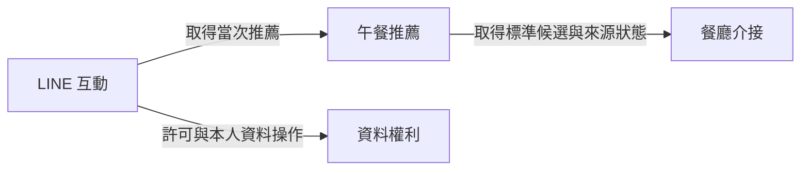

# 午餐決定器 LINE Bot：元件設計

## Sources

- [requirements] `../requirements-analysis/requirements.md`：FR1–FR9、全部子需求、NFR1–NFR9 與 OQ1–OQ10。
- [practices] `../practices-discovery/team-practices.md`：開發順序、test-after、覆蓋率及安全／交付邊界；需求已將其待定的時間與資料條件具體化。
- [Q1]–[Q6] `domain-design-questions.md`：六題均採 A；本人整份摘要回覆 `Looks correct`，確認紀錄 `2abc53cf52199a2053864a7a90c8f3f4b8d235e6eb6b56fa3c1270b9cd7b199b`。
- [upstream-review] `../requirements-analysis/reviews/review-01.md`：R-01 指出寫入成功但確認回應遺失的風險；[Q4] 是本階段的行為細化，不修改上游原文、不代表已實作修正或風險已關閉。
- [decisions] `decisions.md`：ADR-001–ADR-006 的取捨；`traceability.json` 對應全部功能需求及子需求。

本文件定義我們要寫的程式責任，不決定部署單元、程式語言、雲端、資料庫或 API 格式。以下 YAML 是元件與實體清單的唯一來源；圖表均由同一清單衍生。實體僅描述歸屬、識別欄位、屬性名稱及引用，不指定型別、枚舉、基數或 schema 驗證條件。

## Component Catalogue

```yaml
components:
  - name: LineInteraction
    summary: 接收可信 LINE 私訊並協調當次查詢與本人操作的回覆
    behaviour: >
      驗證來源、私訊、輸入及事件時效，保留必要去重與回覆中繼資料；
      先向 DataPrivacy 確認告知與選擇，再協調推薦與獲允許的保存。
      首次未選擇或設定完全不可確認時不外傳位置；呈現真實推薦、保存、查閱與清除狀態。
      以繁中及臺北時間提供文字入口與按鈕，按鈕不取代本人授權。
    responsibilities:
      - 驗證 LINE 事件及可靠本人來源，區分接收成功與回覆被 LINE 接受
      - 協調當次處理期限、取消與可安全執行的回覆，不推播補發
      - 呈現告知、歷史、設定、說明、分頁、刪除確認與本人清除狀態
      - 管理不含位置或完整訊息的事件及回覆紀錄
    depends_on:
      - component: DataPrivacy
        interaction: 判定當次許可並執行保存、設定、本人查閱與刪除
        style: sync
      - component: LunchRecommendation
        interaction: 以已允許當次處理的位置取得推薦或真實失敗結果
        style: sync
    dependents: []
    external_dependencies:
      - name: LINE Messaging API
        kind: third-party-api
        purpose: 事件來源及結果回覆；實際權限與憑證有效性待驗證
      - name: 事件中繼資料儲存能力（待選型）
        kind: database
        purpose: 有限期限的事件去重及回覆狀態，不保存原始訊息或位置
      - name: 受限診斷紀錄能力（待選型）
        kind: other
        purpose: 接收、查詢及回覆的去識別狀態和必要量測
    entities:
      - name: LineEventReceipt
        identifier: eventKey
        attributes: [eventKey, originalEventAt, receivedAt, processingState, replyState, purgeAt]
  - name: LunchRecommendation
    summary: 決定一公里內可回覆的餐廳與有依據的推薦理由
    behaviour: >
      使用標準候選判定餐廳資格、必要資訊、直線距離、營業狀態、去重與穩定排序；
      候選足夠時選三家，不足或零結果如實呈現，不擴圈、不虛構。
      外部失敗與成功但零結果分開；不讀個人歷史，也不自行保存當次位置或餐廳清單。
    responsibilities:
      - 處理當次搜尋點及推薦結果的短暫生命週期
      - 篩選餐廳、計算距離、去重、排序與建立有來源依據的理由
      - 保留未知與來源失敗的意義，不將預設值當事實
    depends_on:
      - component: RestaurantSourceAdapter
        interaction: 取得標準候選及可區分成功與失敗的來源結果
        style: sync
    dependents:
      - component: LineInteraction
        interaction: 以已允許當次處理的位置取得推薦或真實失敗結果
    external_dependencies: []
    entities:
      - name: RecommendationQuery
        identifier: queryKey
        attributes: [queryKey, latitude, longitude, deadline]
      - name: RecommendationResult
        identifier: resultKey
        attributes: [resultKey, queryKey, outcome, candidateKeys, distances, reasons, mapLinks, sourceAttributions]
        references:
          - entity: RestaurantCandidate
            owned_by: RestaurantSourceAdapter
            relationship: 指向當次推薦使用的來源候選與標示依據
  - name: DataPrivacy
    summary: 統一判定同意、本人歷史權利及資料生命週期
    behaviour: >
      擁有目前選擇及版本，判定首次告知、當次處理與保存許可，所有歷史操作另驗本人。
      保存只接受當時及寫入時皆獲允許的新查詢，使用最小歷史欄位，原始事件時間起算 UTC 一曆年。
      管理確認範圍、撤回與刪除界線，拒絕重複及重建；即時讀取保護不等待實體清除。
      區分確認保存、確認未保存與不明結果；到期或刪除後限期清除全部可控內容且不建立位置歷史備份。
    responsibilities:
      - 擁有同意狀態、查詢歷史、刪除確認、保存控制與清除作業資料
      - 決定本人存取、保存資格、版本與刪除截止的有效性
      - 確保保存與撤回或刪除交錯時不越界，核對結果但不誤稱保存成功或失敗
      - 接受後續清除觸發並追蹤不可見、清除中、完成及失敗的真實狀態
      - 控制分類保存期限、清除證據與不含位置的維護告警
    depends_on: []
    dependents:
      - component: LineInteraction
        interaction: 判定當次許可並執行保存、設定、本人查閱與刪除
    external_dependencies:
      - name: 權利與歷史儲存能力（待選型）
        kind: database
        purpose: 同意狀態、最小歷史及隔離的短期控制資料；須證明一致性與清除能力
      - name: 受信任清除觸發能力（待選型）
        kind: other
        purpose: 驅動到期與已受理刪除的實體清除，不夾帶位置內容
      - name: 受限診斷及維護告警能力（待選型）
        kind: other
        purpose: 清除失敗與期限追蹤，不發送使用者推播或洩漏位置
    entities:
      - name: ConsentState
        identifier: subjectKey
        attributes: [subjectKey, savingChoice, noticeVersion, consentVersion, changedAt]
      - name: QueryHistory
        identifier: historyKey
        attributes: [historyKey, subjectKey, queryAt, latitude, longitude, expiresAt, resultSummary]
      - name: DeletionConfirmation
        identifier: confirmationKey
        attributes: [confirmationKey, subjectKey, historyKey, scope, cutoff, issuedAt, expiresAt, confirmationState]
      - name: HistoryWriteControl
        identifier: controlKey
        attributes: [controlKey, subjectKey, eventKey, historyKey, originalEventAt, acceptedOrder, consentVersion, deletionCutoff, writeOutcome, purgeAt]
        references:
          - entity: LineEventReceipt
            owned_by: LineInteraction
            relationship: 以不可反推位置的事件代碼關聯可信受理事件，不向入口回呼取資料
      - name: CleanupJob
        identifier: cleanupKey
        attributes: [cleanupKey, subjectKey, scope, historyKeys, cutoff, effectiveAt, dueAt, cleanupState, lastFailureClass, purgeAt]
  - name: RestaurantSourceAdapter
    summary: 隔離外部餐廳來源的格式、缺漏、權利標示與失敗語意
    behaviour: >
      向已授權來源送出當次必要搜尋點，不送本人識別或歷史；
      驗證外部回應並轉為可評估的候選，保留未知營業狀態及必要標示。
      對整份不可判讀回應回報來源失敗，對個別缺欄候選標示不可用；不將原始回應存入歷史。
    responsibilities:
      - 外部資料格式轉換與可判讀性檢查
      - 提供穩定來源識別、來源分類、座標、地圖及必要標示資訊
      - 保留來源故障與未知資訊，不負責推薦排序或本人資料權利
    depends_on: []
    dependents:
      - component: LunchRecommendation
        interaction: 取得標準候選及可區分成功與失敗的來源結果
    external_dependencies:
      - name: 合法餐廳資料來源（待選型）
        kind: third-party-api
        purpose: 提供候選及當次顯示所需資訊；未選定及告知前僅用受控模擬
    entities:
      - name: RestaurantCandidate
        identifier: candidateKey
        attributes: [candidateKey, providerKey, restaurantKey, name, category, latitude, longitude, openingInfo, mapLink, attribution, observedAt]
```

## Component Diagram



文字備援：LINE 互動呼叫資料權利及午餐推薦；午餐推薦呼叫餐廳介接。資料權利及餐廳介接不回呼入口。共四個元件、三條單向呼叫關係，沒有循環；結果沿呼叫返回，不另畫反向依賴。跨元件的實體識別引用不是反向呼叫或直接資料庫讀取。

## Component Summary

| Component | Purpose | Depends On | Dependents | Entities Owned |
| --- | --- | --- | --- | --- |
| LineInteraction | 可信入口、當次協調與繁中呈現 | DataPrivacy、LunchRecommendation | 無 | LineEventReceipt |
| LunchRecommendation | 候選資格、距離、去重、排序與理由 | RestaurantSourceAdapter | LineInteraction | RecommendationQuery、RecommendationResult |
| DataPrivacy | 同意、本人歷史與刪除生命週期 | 無 | LineInteraction | ConsentState、QueryHistory、DeletionConfirmation、HistoryWriteControl、CleanupJob |
| RestaurantSourceAdapter | 外部格式、來源狀態與標示轉換 | 無 | LunchRecommendation | RestaurantCandidate |

## Entity Ownership

| Entity | Owning Component | Identifier | Attributes | References |
| --- | --- | --- | --- | --- |
| LineEventReceipt | LineInteraction | eventKey | eventKey、originalEventAt、receivedAt、processingState、replyState、purgeAt | 無 |
| RecommendationQuery | LunchRecommendation | queryKey | queryKey、latitude、longitude、deadline | 無 |
| RecommendationResult | LunchRecommendation | resultKey | resultKey、queryKey、outcome、candidateKeys、distances、reasons、mapLinks、sourceAttributions | RestaurantSourceAdapter.RestaurantCandidate |
| ConsentState | DataPrivacy | subjectKey | subjectKey、savingChoice、noticeVersion、consentVersion、changedAt | 無 |
| QueryHistory | DataPrivacy | historyKey | historyKey、subjectKey、queryAt、latitude、longitude、expiresAt、resultSummary | 無跨元件引用 |
| DeletionConfirmation | DataPrivacy | confirmationKey | confirmationKey、subjectKey、historyKey、scope、cutoff、issuedAt、expiresAt、confirmationState | 無跨元件引用 |
| HistoryWriteControl | DataPrivacy | controlKey | controlKey、subjectKey、eventKey、historyKey、originalEventAt、acceptedOrder、consentVersion、deletionCutoff、writeOutcome、purgeAt | LineInteraction.LineEventReceipt |
| CleanupJob | DataPrivacy | cleanupKey | cleanupKey、subjectKey、scope、historyKeys、cutoff、effectiveAt、dueAt、cleanupState、lastFailureClass、purgeAt | 無跨元件引用 |
| RestaurantCandidate | RestaurantSourceAdapter | candidateKey | candidateKey、providerKey、restaurantKey、name、category、latitude、longitude、openingInfo、mapLink、attribution、observedAt | 無 |

共九個實體，每個只有一個程式擁有者；「實體」不表示一定持久保存。RecommendationQuery、RecommendationResult、RestaurantCandidate 是當次處理資料，不是歷史表。其他元件可以收到必要結果或識別參照，不能直接寫入或任意讀取別人的儲存；引用失效或目標已清除時不能重建內容。語意與生命週期如下，詳細 schema 留給 Functional Design。

## External Dependencies

| Component | Dependency | Kind | Purpose |
| --- | --- | --- | --- |
| LineInteraction | LINE Messaging API | third-party-api | 可信事件接收及結果回覆，並非送達保證 |
| LineInteraction | 事件中繼資料儲存能力（待選型） | database | 無位置的去重與回覆狀態 |
| LineInteraction | 受限診斷紀錄能力（待選型） | other | 去識別狀態與量測 |
| DataPrivacy | 權利與歷史儲存能力（待選型） | database | 分類隔離的同意、歷史與控制資料 |
| DataPrivacy | 受信任清除觸發能力（待選型） | other | 驅動到期及已受理刪除的清除作業 |
| DataPrivacy | 受限診斷及維護告警能力（待選型） | other | 清除失敗與期限告警，不含位置 |
| RestaurantSourceAdapter | 合法餐廳資料來源（待選型） | third-party-api | 授權候選、地圖及來源標示 |

這些是必要外部能力，不是已選定產品、已開通資源或新的程式元件。兩處儲存名稱代表資料責任隔離，不承諾兩個實體資料庫；是否共用實體基礎設施、受信任觸發方式及告警通道都留待後續設計。午餐推薦沒有自己的持久資料依賴。[Q1–Q3][requirements OQ1、OQ4、OQ6–OQ10]

## Interaction and Lifecycle

清單中的 `sync` 表示呼叫者取得當次結果的請求／回應契約，不是部署拓撲或執行緒選擇，也不要求 HTTP 接收確認等到推薦完成。接收確認與 LINE 結果回覆是兩個量測點；後續設計須在不持久排隊位置的前提下同時滿足一秒接收及當次處理／回覆期限，不能用本圖宣稱平台已具備該能力。

### 當次位置查詢

- LineInteraction 驗證來源、私訊、支援輸入與事件時間，控制去重、接收／回覆狀態及十秒處理期限；私訊驗證失敗、群組、不合法位置或超時效事件不得流入推薦或權利操作。允許事件時間為接收前 24 小時至後五分鐘，含邊界；來源身分可信不等於已獲歷史操作權限。[FR1][NFR1–NFR3]
- 向 DataPrivacy 提供從可信事件取得的本人上下文、事件代碼與原始時間。告知與選擇未完成時，僅回告知與保存／不保存選擇，不保留位置等回答；選好後須重傳。完全讀不到設定時停止這次搜尋，不外傳、不排隊，設定更新故障也不假稱成功；可確認的不保存選擇仍能推薦。[FR2][Q5]
- 獲允許當次處理後，向 LunchRecommendation 傳遞必要搜尋點、查詢識別及剩餘期限，不傳個人歷史。RestaurantSourceAdapter 只向合法來源傳必要位置與查詢參數，不傳本人識別、同意狀態或歷史；來源未選定及權利未確認時只用合成資料與受控模擬。[FR3][NFR6]
- Adapter 區分可判讀成功、個別候選資訊不足與整份失敗。Recommendation 在未四捨五入直線距離不大於 1,000 公尺內篩選來源分類為餐廳且名稱／座標／地圖足夠的候選；排除明確休息或停業者、去重，已知營業中先於未知，各組依距離再穩定店家識別排序。足夠時前三家，少於三家說明實際數量，零結果不冒充來源故障；理由依來源／距離，不保證營業或座位。[FR3、FR4.1–FR4.2]
- 只有當時已同意且寫入時仍獲允許的新有效查詢交由 DataPrivacy 保存，內容限 QueryHistory 白名單；找到餐廳、零結果或外部失敗均可保存真實結果。LineInteraction 合成一次如實回覆，保存失敗不抹掉推薦。推薦清單與供應方回應不存入一年歷史。[FR4.3、FR5][Q3–Q4]
- 保存結果由 DataPrivacy 判定：已確認保存、確定未保存、無法確認。已提交但回應遺失或逾時不能歸成未保存；仍回可用推薦並提示「目前無法確認是否已保存，可稍後查看歷史」。核對只用既有事件／歷史識別，不重新保存位置；無法核對就維持不明，不為核對拖延當次回覆或新增推播。後續契約須連同重送及安全重試定義此分支。[Q4][upstream-review]
- LINE 接受回覆與使用者看到不同；LINE 不可用或憑證失效時記錄真實失敗，不承諾送達、不盲目重送、不以推播補發。短暫位置處理完成或十秒到達即釋放；不可將未保存位置寫入檔案、持久佇列、診斷或等待恢復。[NFR1、NFR2、NFR4]

### 本人權利與順序界線

- DataPrivacy 是許可及生命週期的唯一判定者。每次設定、查閱、分頁、確認、刪除及清除狀態查閱均核對本人，不信任按鈕、紀錄識別或分頁識別所宣稱的身分；LINE 入口提供可信主體，但不替 DataPrivacy 作最終授權。[FR6–FR8][NFR3][Q2、Q6]
- 原始事件時間決定查詢時間與 UTC 一曆年到期；閏日對應次年 2 月 28 日同時刻，顯示用 Asia/Taipei。DataPrivacy 的可信受理順序與同意版本負責新／舊查詢及寫入許可，不能只比較客戶端時間；LineInteraction 必須交付可核對的可信事件上下文。Contract Design 定義受理、許可判定、確認畫面截止與寫入的先後關係及失敗語意，Functional Design 再選完整資料表示。[FR5.3、FR7–FR8][requirements OQ3]
- 保存的最後有效性檢查與可見寫入必須共享可證明的序列化界線，不能「先讀同意、隔一段時間直接寫」。撤回成功即阻止在途與新保存，既有歷史仍按原期限可查；重新同意只處理新事件，不補存撤回期間或其他舊查詢。若無法證明事件相對同意／刪除的先後，拒絕保存並如實回覆，不猜測許可。[FR5.1、FR8][Q2]
- 刪除確認綁本人及單筆識別或全部範圍／截止，五分鐘內有效、達五分鐘過期；取消、過期、跨人及重複確認不得誤刪。全部刪除界線在確認畫面形成，涵蓋該界線以前在途／延遲查詢，不涵蓋畫面後新查詢；單筆只擋該筆重建。精確的原始時間、受理順序與刪除截止對應須在契約階段證明，禁止用收到確認的時間任意擴大範圍。[FR7][requirements OQ3]
- 歷史新到舊每頁至多五筆，每次讀取／分頁重新套用本人、到期與刪除規則，呈現臺北時間、搜尋點地圖、真實結果及刪除入口。撤回保存不等於刪掉既有歷史；刪除確認／取消、過期重啟與本人查閱清除進度均在 LINE 私訊完成，無獨立網站或推播。[FR6–FR8][NFR7][Q6]

### 不可見、實體清除及資料分類

| 資料／能力 | 責任與保護 | 既定生命週期 |
| --- | --- | --- |
| 當次位置、RecommendationQuery／RecommendationResult／RestaurantCandidate | 推薦及介接只做當次處理；LINE 不留原始訊息；未完成選擇直接丟棄位置 | 已選不保存時處理完成或十秒即釋放，無持久佇列；來源內容不新增持久快取或封存 |
| QueryHistory | DataPrivacy 僅保存七個白名單屬性，無來源回應、餐廳清單或自由文字位置名稱 | 原始事件時間起算 UTC 一曆年；重送、重試及新查詢都不延長 |
| ConsentState | DataPrivacy 保存目前選擇與版本，不保存無期限的同意變更歷史或位置；撤回不能抹去拒絕狀態 | 目前有效狀態保留，服務終止後 30 天內清除 |
| LineEventReceipt | LineInteraction 管理不含位置／原始訊息的事件代碼及處理／回覆狀態 | 最多七天；不能靠短期紀錄代替事件時效驗證 |
| HistoryWriteControl、DeletionConfirmation、CleanupJob | DataPrivacy 只保留必要主體關聯、識別、狀態與時間，不複製位置；確認的操作有效期與技術資料期限分開 | 技術資料最多七天；刪除確認五分鐘到期，不延長操作效力 |
| 診斷、量測及安全證據 | 授權開發／維護人員可讀；只用時間、隨機關聯代碼、狀態／錯誤類別與必要量測 | 最多 30 天，不含精確位置、完整訊息、原始使用者 ID 或秘密 |

到期當下或刪除成功受理時，DataPrivacy 立即使內容對所有讀取不可見，不能等待清除觸發或只在 UI 過濾。殘留內容僅供清除，不供推薦或本人查閱；其在主要儲存、快取及可控副本內的實體清除必須於生效後 24 小時內完成。只有確認全部應清內容已清除才能顯示完成；否則顯示清除中或真實失敗，告警本身失敗也不能宣稱已刪除。[FR7.3、FR9][NFR4–NFR5]

七天控制資料清除不准解除已刪歷史的不可見性，也不能讓不明提交重建內容；短期識別引用不是永久外鍵保留理由。後續設計須證明主儲存的不可讀殘留與清除作業期限相容，並測試清除失敗、重試、控制資料消失與復原。24 小時未清完已屬驗收失敗，不能以延長控制紀錄或忽略失敗遮掩。[FR9][NFR2、NFR4]

不建立位置歷史持久備份／匯出；平台複本、自動備份、日誌及暫存皆需查核。TTL 名稱、排程名稱或「加密」不構成完成證據；服務若不能滿足不可見與清除上限，阻擋真人保存並回報，而非改保存期限。復原不得恢復已刪／到期內容，接受未備份歷史無法救回的取捨；LINE 與供應方自己的資料處理另作告知，不宣稱本專案能代刪其全部紀錄。[FR9.3][NFR6][requirements OQ4、OQ8]

## Rationale

| Component | 為何獨立 | 代價與可逆性 |
| --- | --- | --- |
| LineInteraction | LINE 協定、輸入與回覆生命週期不同於推薦或歷史權利 | 承擔部分成功協調；未來可抽出協調者，但目前不增加第五元件 |
| LunchRecommendation | 餐廳資格、排序及理由可用受控候選獨立驗證，不與本人歷史耦合 | 必須定義清楚的來源結果介面；未來可調整內部實作而不改入口 |
| DataPrivacy | 同意、本人存取與刪除／到期需要共同的一致性邊界與單一資料擁有者 | 責任與測試較集中，故障會暫停無法確認設定的查詢；未來拆分須先證明一致性 |
| RestaurantSourceAdapter | 外部格式、權利標示、缺漏及失敗變化率與推薦政策不同，不是無邏輯轉接 | 多一個介面，換來源仍須重新驗證條款／資訊涵蓋率；必要時可併回推薦內部 |

### Component-boundary Options

- Option A — 四元件：來源與推薦分開，較易獨立測試及換來源；多一個介面，不增加部署服務假設。可在保留契約下調整程式組織。
- Option B — 三元件：來源介接置於推薦內部，介面較少；外部格式與推薦政策較容易一起變更，未來可再抽離。
- Recommendation／人類選擇：Q1 採 A，Q2 統一資料權利、Q3 不另設協調者，使四元件與單向依賴一致。來源詳見 ADR-001–ADR-003。
- Alternatives Rejected：本輪未採來源併入推薦、同意與歷史拆成兩個擁有者、或獨立第五個協調元件；它們不是不可行，而是目前增加耦合或一致性成本多於收益。正式階段核准由後續人類決定，不以 Q&A 當作可跳過核准的依據。

## Quality and Verification Handoff

| 需求 | 責任／邊界 | 下游必須提供的證據，尚未執行 |
| --- | --- | --- |
| NFR1 | LineInteraction 協調整體期限，各依賴配合取消與有界處理 | 20 合成身分、每秒一筆五分鐘及同時五筆；接收 p95 ≤ 一秒、LINE 接受回覆 p95 ≤ 五秒、處理十秒；納入故障與未回覆，不把受控測試當真實證據 |
| NFR2 | LineInteraction 驗來源／時效及回覆去重；DataPrivacy 保護寫入與權利操作 | 時效邊界、重送／併發、撤回／刪除交錯、重新同意、七天技術資料清除後舊事件拒絕；LINE 憑證實際期限待查 |
| NFR3 | LineInteraction 交付可信本人上下文；DataPrivacy 逐操作授權 | 至少兩個合成身分交換歷史／分頁／確認識別仍不能越權；合法本人可完成操作 |
| NFR4 | 各元件遵守資料分類，DataPrivacy 管控歷史與權利生命週期 | 記憶體／持久儲存／診斷／副本檢查，十秒／七天／30 天與一年邊界，控制紀錄清除不解除不可見 |
| NFR5 | 各元件回傳真實結果，LineInteraction 呈現；DataPrivacy 驅動清除告警 | 來源、保存、查閱、受理／清除及 LINE 故障注入；含已提交但確認回應遺失、維護告警失敗 |
| NFR6 | 外部依賴選型與提出者授權；DataPrivacy 不提前開放真人保存 | 資源／費用、來源權利、適用政策、所在地及平台控制證據；不得默認授權或合規 |
| NFR7 | LineInteraction 呈現，DataPrivacy 提供真實授權與狀態 | 繁中、臺北時間、純文字狀態區分、按鈕取消／過期與命令備援、店家與搜尋點地圖不混淆 |
| NFR8 | 四元件皆有可測邊界，開發／品質工作驗證整合 | test-after；應用行覆蓋率 ≥ 80%，含未載入來源及可審查排除清單；必要案例與授權真實完整流程不可省略 |
| NFR9 | 後續開發與 CI，不是新增業務元件 | 本機／CI 一致命令，適用建置、格式／lint、單元／關鍵整合、秘密／依賴／SAST；失敗或未做不得算通過 |

`traceability.json` 的 `OK` 僅代表已分配設計責任，不代表程式、測試、安全控制或真實整合已通過。當前沒有應用程式建置、應用測試、部署或真人資料處理的完成主張。

## Assumptions & Open Questions

- Units Generation 依四個元件決定部署單元與相依；元件名不能直接當四個服務。Contract Design 明訂呼叫輸入／輸出、錯誤與不明保存結果、可信身分、受理／同意／刪除截止順序及清除狀態契約。
- Functional Design 定義完整實體 schema、狀態轉移、演算法及可執行驗證；本文件屬性名稱不預選型別或資料庫實體結構。
- NFR／Infrastructure Design 選擇時鐘、一致性與隔離機制、取消與期限、儲存及不落盤限制、平台日誌／副本清除、可信觸發及維護告警；須證明既定約束可同時達成，而非以產品名稱代替證據。
- requirements OQ1–OQ10 仍依其指定時點跟進；OQ3 已指定 DataPrivacy 的判定責任與可信事件交付，但具體順序／失敗證明未完成；OQ5 已選文字入口加按鈕，格式／長度／相容性未驗證。其他供應方、資源、地區／政策、帳號、成本、日期及運作責任仍未知。
- 此設計不授權正式上線、建立資源、付費、提交／分支或外部掃描，不加入群組、進階輸入、收藏／篩選／重抽、交易、推播、分析、網站或公司整合。
